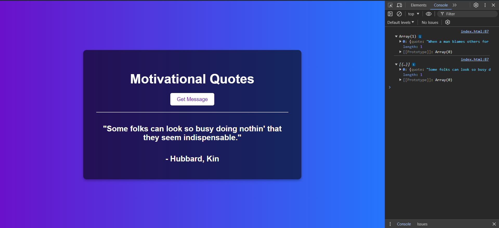

# Motivational Quotes Web App

Motivational Quotes Web App is a simple web page that fetches and displays random motivational quotes focused on happiness from an external API. It's designed to inspire and uplift users with positive messages.

## Preview



## Features

- **Random Quote Fetching**: Utilizes the `fetch()` function in JavaScript to retrieve random motivational quotes from the [API Ninjas Quotes API](https://api.api-ninjas.com/v1/quotes?category=happiness).
  
- **Display**: Dynamically updates the quote and its author (if available) on the webpage upon user interaction.
  
- **Responsive Design**: Ensures a visually appealing and user-friendly experience across different devices with CSS styling.

## Usage

To use this project:

1. Clone the repository:

   ```bash
   git clone https://github.com/your-username/motivational-quotes.git

2. Open index.html in your web browser.

3. Click the "Get Message" button to fetch a new motivational quote instantly.

## How It Works
The application sends a request to the API with your API key to fetch random quotes categorized under "happiness". Upon receiving a response, it updates the HTML content dynamically to display the fetched quote and its author (if provided).

## Contributions
Contributions to enhance the functionality, design, or user experience of the Motivational Quotes Web App are welcome. Feel free to fork the repository, make improvements, and submit a pull request. For major changes, please open an issue first to discuss the proposed updates.

## License
This project is licensed under the MIT License. See the LICENSE file for details.


### Notes:
- Ensure you replace `your-username` in the clone URL with your GitHub username or the repository organization name.
- Make sure to upload `preview.png` to your repository and update the image reference (``) in the README accordingly.
- Adjust the description and details as per your specific project requirements and preferences before uploading to your GitHub repository.
